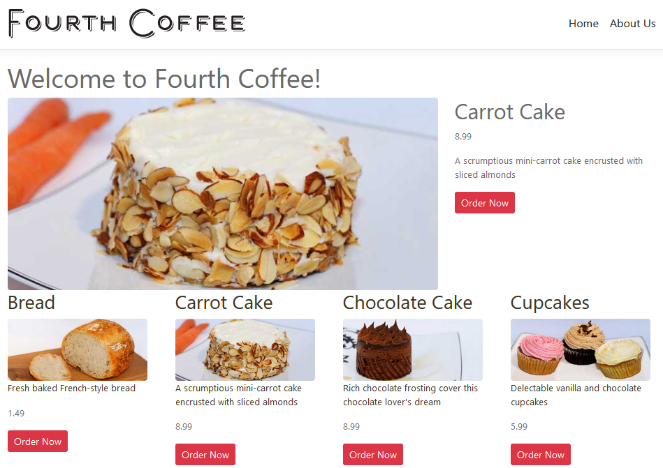

# .NET Sample Reference Application

## SPA Application (Razor Pages)

## Important notes !!!
The project uses Oracle Autonomous Database (ADB) configured with [Oracle Free Cloud]([https://docs.docker.com/docker-for-windows/install/](https://www.oracle.com/es/cloud/free/)). You must have to configure your connection string configured with [user secret](https://github.com/CoderDamian/Bakery/blob/250a8caf165c750d083c6ffbf7b836d2108d9651/BakeryApp/RESTFul/RESTFul.csproj#L7) according with [connection strings](https://github.com/CoderDamian/Bakery/blob/250a8caf165c750d083c6ffbf7b836d2108d9651/BakeryApp/RESTFul/appsettings.json#L9) and the corresponding [wallet connection](https://github.com/CoderDamian/Bakery/blob/250a8caf165c750d083c6ffbf7b836d2108d9651/BakeryApp/DataPersistence/BakeryDbContext.cs#L22).

## Read further

- [Razor pages](https://www.learnrazorpages.com/razor-pages/tutorial/bakery)
- [JWT](https://codepedia.info/jwt-authentication-in-aspnet-core-web-api-token)
